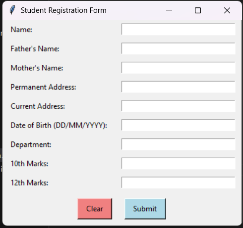

# Registration Form

This is a simple registration form application built using Python and `tkinter`. The form collects user information such as Name, Father's Name, Mother's Name, Permanent Address, Current Address, Date of Birth, Department, 10th Marks, and 12th Marks. The collected data is saved in an Excel file (`registration_data.xlsx`) using the `openpyxl` library.

## Features

- **User Input Fields**: The form includes input fields for Name, Father's Name, Mother's Name, Permanent Address, Current Address, Date of Birth, Department, 10th Marks, and 12th Marks.
- **Validation**: The form validates the input data to ensure that all required fields are filled, marks are within the valid range (0-1000), and the date of birth is in the correct format (DD/MM/YYYY).
- **Save to Excel**: The collected data is saved in an Excel file (`registration_data.xlsx`). If the file does not exist, it is created with appropriate headers. If the file exists, new data is appended to it.
- **Clear Form**: The form includes a "Clear" button to reset all input fields.
- **Submit Form**: The form includes a "Submit" button to validate and save the data.

## How to Use

1. **Run the Application**: Execute the `registration_form.py` script to launch the registration form.
2. **Fill in the Details**: Enter the required information in the input fields.
3. **Submit the Form**: Click the "Submit" button to validate and save the data. If there are any validation errors, appropriate error messages will be displayed.
4. **Clear the Form**: Click the "Clear" button to reset all input fields.

## Data Storage

The data is saved in an Excel file (`registration_data.xlsx`) in the following format:

| Name | Father's Name | Mother's Name | Permanent Address | Current Address | Date of Birth | Department | 10th Marks | 12th Marks |
|------|---------------|---------------|-------------------|-----------------|---------------|------------|------------|------------|
| John Doe | Richard Doe | Jane Doe | 123 Main St | 456 Elm St | 01/01/2000 | Science | 950 | 900 |

## Screenshot

## Dependencies

- Python 3.x
- `tkinter` (usually included with Python)
- `openpyxl` (install using `pip install openpyxl`)

## Code Overview

### Form Layout

The form layout is created using `tkinter` widgets such as `Label`, `Entry`, and `Button`. The input fields are arranged in a grid layout.

### Validation

The `validate_date` function checks if the date is in the correct `DD/MM/YYYY` format and within a valid range. The `submit_form` function validates all input fields and ensures that marks are within the range of 0 to 1000.

### Saving Data

The `submit_form` function saves the validated data to an Excel file using the `openpyxl` library. If the file does not exist, it creates a new file with headers. If the file exists, it appends the new data to the existing file.

### Clear Form

The `clear_form` function resets all input fields to empty.

## License

This project is licensed under the MIT License.
